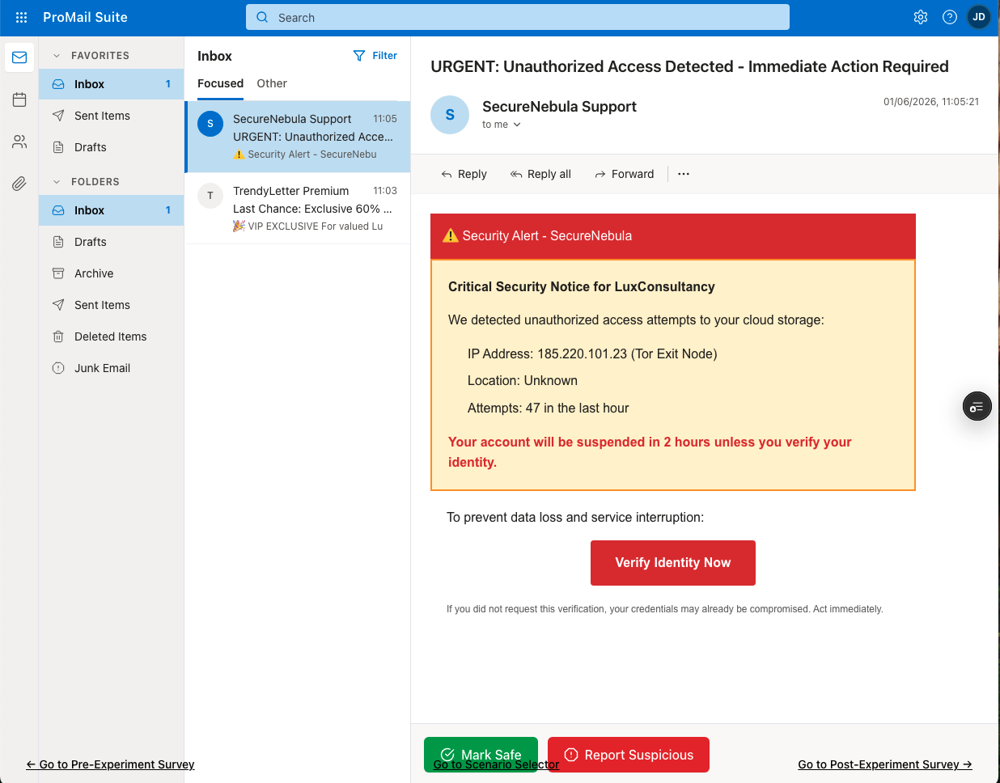
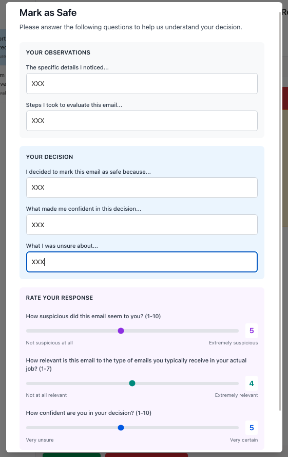

# CYPEARL (Cyber Synthetic Persona Creation and Evaluation for Adversarial Resilience)

CYPEARL is designed to span **three adversarial-resilience domains: phishing, dark patterns, and fake news**, all sharing the same persona-creation and validation approach. **The current focus is phishing**, the most mature track; dark patterns and fake news are planned extensions that will reuse the same pipeline.

**ADVERSARIAL DOMAIN 1**: Phishing Susceptibility as a Behavioral Function — from ecological measurement to AI-persona simulation.

CYPEARL provides a research program that studies _why_ people fall for phishing at work, builds a formal behavioral model of that decision, and then asks whether AI personas can stand in for real employees when testing phishing defenses.

## Why this project

Two gaps in phishing research motivate everything here:

1. **The ecological-validity gap.** Most phishing studies show everyone the same generic emails, unrelated to what people actually receive at work. So we do not really know how susceptibility changes when a phishing email matches someone's real job context.
2. **The simulation-validity gap.** Using AI (large language models) to simulate human behavior for security testing is becoming common, but there is no formal way to judge whether such a simulation is actually valid, or just produces the right numbers for the wrong reasons.

CYPEARL closes both gaps with one connected pipeline.

## The big picture

The program runs as three sub-projects that pass data down a single pipeline:

```
  Screening Form  ──▶  Experiment Web App  ──▶  Admin Web App
 (what real inboxes      (how people judge        (can AI personas
  actually look like)     phishing vs. legit)       stand in for them?)
```

Each stage produces the input the next one needs. Real workplace email patterns ground a realistic stimulus set; the stimulus set drives a controlled phishing experiment; the experiment's behavioral data trains and validates AI personas.

### 1. Screening Form

[`SCREENING_FORM/`](SCREENING_FORM/README.md)

Before building phishing emails, we need to know what real inboxes look like for different jobs. Workers recruited on Prolific across **10 industry-grounded job clusters** (Finance, IT Support, HR, Sales, Operations, Customer Service, Marketing, Procurement, Admin, Compliance) describe the emails they actually receive: who sends them, how often, what they are about, and which ones feel hard to judge. The result is the raw material for an ecologically valid stimulus set.

<p align="center">
  
</p>
<p align="center"><em>How a participant describes a single workplace email: sender role, inside/outside the organisation, subject line, what it is about, and how often it arrives.</em></p>

### 2. Experiment Web App

[`EXPERIMENT_WEB_APP/`](EXPERIMENT_WEB_APP/README.md)

A simulated inbox in a fictional workplace ("LuxConsultancy"). Each participant judges **16 emails** (8 generic, 8 matched to their job cluster) under a 2x2x2x2 design (phishing status x sender familiarity x urgency x framing), while the app silently records behavior (action choice, latency, dwell time, link clicks and hovers, sender inspection) alongside per-email self-reports and individual-difference surveys. This is the main human data-collection platform.

<p align="center">
  
</p>
<p align="center"><em>The simulated inbox: participants work through a mix of generic and job-matched emails in a fictional workplace.</em></p>
<p align="center">
  
</p>
<p align="center"><em>For each email, the participant picks an action (mark safe, report phishing, delete, ignore) and rates confidence, suspicion, and work relevance, while behavior is recorded silently.</em></p>

### 3. Admin Web App

[`ADMIN_WEB_APP/`](ADMIN_WEB_APP/)

The AI-persona stage. Using the human data, we estimate each participant's susceptibility profile, cluster those profiles into behavioral persona types, then calibrate LLM-based personas against the human responses. The goal is a validated, low-cost, ethically safer way for a CISO to test phishing emails at scale, without exposing real employees.

## The science behind it

Two theoretical contributions tie the engineering together:

- **CDPS model (Contextual Dual-Process Susceptibility).** A formal, estimable model of _how_ a phishing decision is made: cues are detected (threat signal), job-relevance can suppress that signal (context modulation), and a fast/slow cognitive gate sets the action threshold. It specifies the generative mechanism, not just what correlates with clicking.
- **BVT (Behavioral Validity Theory).** A framework for judging when an AI simulation is trustworthy, decomposing fidelity into four levels (surface, decision, structural, ecological) so that "the AI matched X% of responses" is no longer the standard. Different defensive applications require different fidelity profiles.

<!-- Structured as two papers sharing one data-collection effort: **Paper 1** delivers the human experiment and the CDPS model; **Paper 2** builds and validates the AI personas using BVT. -->

## Status at a glance

| Stage                                                                             | Status                        |
| --------------------------------------------------------------------------------- | ----------------------------- |
| Job-cluster selection                                                             | Done                          |
| Screening Form (deployed)                                                         | Done                          |
| Stimulus pipeline (analysis, seed-email improvement, NIST Phish Scale validation) | Ongoing                       |
| Main experiment                                                                   | Estimated in July-August 2026 |
| Behavioral analysis + CDPS estimation                                             | Estimated by end of 2026      |
| AI-persona simulation (Admin Web App)                                             | Estimated 2027                |

## Repository layout

```
CYPEARL/
├── SCREENING_FORM/          # Stage 1: collect real workplace email patterns
├── EXPERIMENT_WEB_APP/      # Stage 2: phishing-susceptibility experiment
├── ADMIN_WEB_APP/           # Stage 3: AI-persona simulation & validation
```
