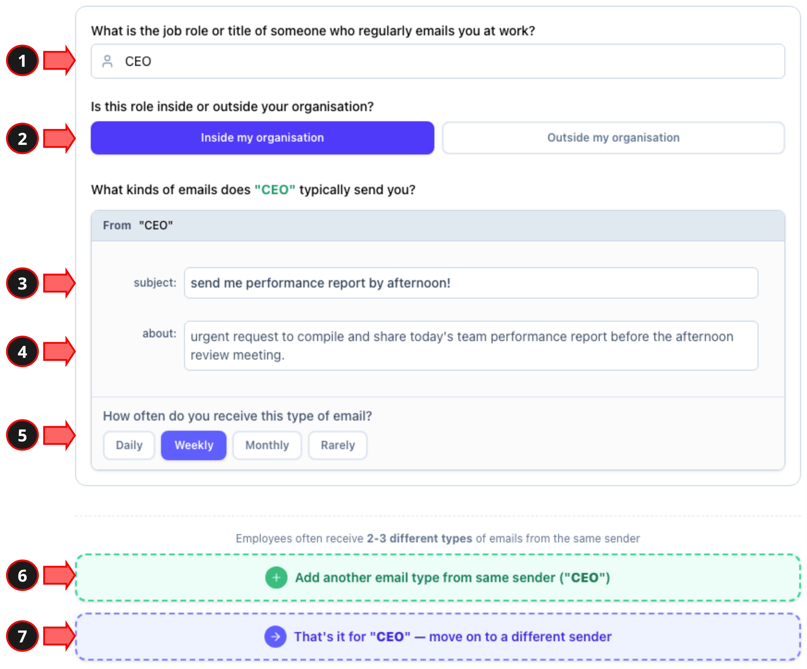

# CYPEARL — Screening Form

A web app that collects real workplace email patterns from employees, used to ground the phishing stimuli in the main CYPEARL experiment.

**Live demo:** https://workplace-email.vercel.app/

## What it is

The first stage of the CYPEARL phishing-susceptibility pipeline. Before we can build realistic phishing emails, we need to know what real inboxes actually look like for different jobs. This app surveys workers recruited on Prolific across **10 job clusters**: Finance/Accounts Payable, IT Support/Helpdesk, HR/People Operations, Sales/Business Development, Operations/Logistics, Customer Service/Client Support, Marketing/Communications, Procurement/Purchasing, Administrative/Executive Support, and Compliance/Risk/Audit.

## What participants do

A guided, single-sitting flow (about 10 minutes). Progress is auto-saved after every step (in the browser and, once a Prolific ID is entered, on the server), so a participant can close the tab and resume where they left off, even on another device.

1. **Welcome & consent** — read a short overview of the study, give informed consent, and enter the Prolific ID.
2. **Study details** — see the time estimate, base pay, and how the per-email bonus works.
3. **Quick comprehension check** — two questions confirming the participant understood the privacy rules (no real names) and the bonus rules before starting.
4. **Job role** — pick the job cluster, enter a job title, and describe daily tasks in 1 to 2 sentences.
5. **Part A: job-specific emails** — describe the work emails tied to the role, one sender at a time (at least 5 emails total; extra emails earn the bonus). This is the step the sample image below explains.
6. **Part B: general workplace emails** — describe mail everyone in the company gets regardless of role (at least 3).
7. **Part C: suspicious / hard-to-judge emails** — describe work emails they were unsure whether to trust (at least 5).
8. **Done** — the response is submitted and the participant copies a completion code back to Prolific.

### How a single email is described (Part A)

To make the task concrete, Part A opens with this annotated example. For each sender, the participant gives the sender's job role (no personal names), whether they are inside or outside the organisation, then for each email a subject line, a one-line summary of what it is about, and how often it arrives. They can add more emails from the same sender or move on to a new one.

<!--  -->

<p align="center">
  
</p>

## What it collects

For each participant's job cluster:

- **Job role confirmation** plus a free-text description of daily responsibilities
- **Senders:** who emails them (role, internal vs. external, frequency)
- **Content:** typical subjects, themes, and communication patterns
- **Generic emails:** non-job-specific mail everyone receives (IT alerts, HR notices)
- **Suspicious emails:** workplace mail they find hard to judge
- **Sender's job role** — who typically sends this email (no personal names).
- **Inside / outside** your organisation.
- **Subject line** — a short, realistic example.
- **About** — a one-line summary of what the email is for.
- **How often** you receive this type of email.
- **Add another email** — describe one more email type from the same sender.
- **Move to next sender** — start describing emails from a different job role.

Targeting 6-7 participant responses per each of the 10 job clusters.

## What it produces

Raw responses are stored in MongoDB. Helper scripts in `backend/` turn that data into actionable inputs for stimulus design:

- `extract_emails_by_cluster.py` extracts collected email examples per cluster (output in `extracted_emails/`)
- `clear_db.py` resets the database during development

These outputs feed the seed-email improvement and NIST validation steps of the wider study.

## Tech stack

- **Backend:** Python, FastAPI, MongoDB (async Motor)
- **Frontend:** React, Vite
- **Hosting:** Vercel (frontend), MongoDB Atlas (data)

## Project layout

```
SCREENING_FORM/
├── backend/
│   ├── main.py                         # FastAPI app + survey-submission API
│   ├── extract_emails_by_cluster.py    # email extraction utility
│   ├── clear_db.py                     # dev DB reset
│   └── requirements.txt
├── frontend/                           # React + Vite survey UI (multi-step flow)
└── docs/job_roles.txt                  # the 10 job-clusters emails prepared for phishing email susceptibility experiment (will be updated once prepared the final list)
```

The API exposes `POST /users` (register at consent), `PUT/GET /draft/{pid}` (auto-save and resume), `POST /submit` (finalize), and `GET /responses` (admin export).

## Running locally

After `git clone`:

**Backend**

```bash
cd SCREENING_FORM/backend
python -m venv .venv && source .venv/bin/activate
pip install -r requirements.txt
# create a .env with:
#   MONGO_URL=<your MongoDB connection string>
#   SCREENING_DB_NAME=cypearl_screening   # optional, this is the default
uvicorn main:app --reload          # serves on http://localhost:8000
```

**Frontend**

```bash
cd SCREENING_FORM/frontend
npm install
npm run dev                         # serves on http://localhost:5173
```

The backend already allows `localhost:5173` and the deployed Vercel origin via CORS.

## Where this fits

Stage 1 of 3 in the CYPEARL pipeline: **Screening Form** → Experiment Web App → Admin Web App.
